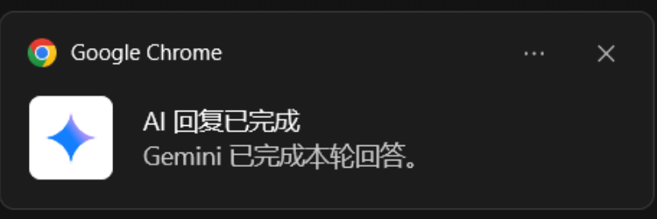
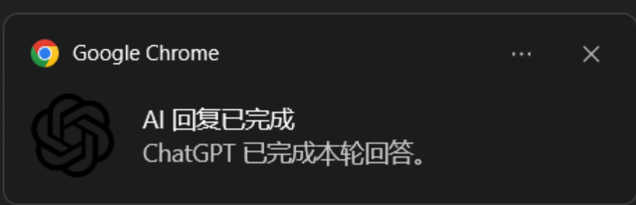

# AI Reply Notifier

> 让你不用一直盯着 AI 页面，也不错过每一次回复完成。

[](https://developer.chrome.com/docs/extensions/)
[](https://developer.mozilla.org/docs/Web/JavaScript)
[](#)

## 项目简介

`AI Reply Notifier` 是一个原生 Chrome/Edge 插件（Manifest V3），用于在 **ChatGPT / Gemini** 回答完成时提醒你。

适合这些场景：

- 你发完问题后会切到别的标签页
- 页面还在前台，但你暂时没盯着屏幕
- 不想错过回答完成的时机

---

## 目前能力

- ChatGPT / Gemini 页面自动注入与平台识别
- DOM 监听（`MutationObserver + debounce`）
- 生成状态检测（`generating -> completed`）
- 回答完成提醒（系统通知）
- 提醒防抖：同指纹去重 + 冷却时间
- 按平台显示通知图标  
  - ChatGPT: `icons/notify-chatgpt-128.png`  
  - Gemini: `icons/notify-gemini-128.png`  
  - 回退: `icons/icon128.png`
- 中文设置页（可配置提醒模式、冷却时间、调试开关）
- 用户活跃度判断（页面隐藏 / 窗口失焦 / 长时间无操作）

---

## 效果预览

### Gemini 完成提醒



### ChatGPT 完成提醒



---

## 快速开始（3 分钟）

### 1) 下载项目

```bash
git clone <你的仓库地址>
cd <项目目录>
```

或者直接在 GitHub 下载 ZIP 并解压。

### 2) 在 Chrome 加载插件

1. 打开 `chrome://extensions/`
2. 开启右上角 `开发者模式`
3. 点击 `加载已解压的扩展程序`
4. 选择项目根目录（包含 `manifest.json` 的文件夹）

### 3) 在 Edge 加载插件

1. 打开 `edge://extensions/`
2. 开启 `开发人员模式`
3. 点击 `加载解压缩的扩展`
4. 选择同一个项目目录

---

## 新手测试教程

### A. 验证注入

1. 打开 `https://chatgpt.com/` 或 `https://gemini.google.com/`
2. 看页面右上角是否出现调试面板
3. 打开 Console，检查是否有 `[AI Reply Notifier]` 日志

### B. 验证提醒

1. 发送一个问题
2. 在 AI 生成时切换到别的标签页或窗口
3. 回答完成后观察是否弹系统通知

### C. 验证平台图标

1. ChatGPT 完成时应显示 ChatGPT 图标
2. Gemini 完成时应显示 Gemini 图标
3. 未知平台时回退默认图标

---

## 设置说明

在扩展管理页打开本插件的 `扩展选项`，可配置：

- 启用 ChatGPT 提醒
- 启用 Gemini 提醒
- 启用系统通知
- 提醒模式  
  - 仅后台提醒  
  - 后台或无操作时提醒  
  - 始终提醒
- 无操作判定时间（秒）
- 提醒冷却时间（秒）
- 显示调试面板
- 启用调试日志

---

## 项目结构

```text
.
├─ manifest.json
├─ background.js
├─ content.js
├─ detector.js
├─ observer.js
├─ state.js
├─ notifier.js
├─ activityTracker.js
├─ debugPanel.js
├─ settings.js
├─ options.html / options.css / options.js
├─ popup.html / popup.css / popup.js
├─ styles.css
├─ docs/
│  └─ images/
│     ├─ Chatgpt_notify.png
│     └─ Gemini_notify.png
└─ icons/
   ├─ icon16.png
   ├─ icon32.png
   ├─ icon48.png
   ├─ icon128.png
   ├─ notify-chatgpt-128.png
   └─ notify-gemini-128.png
```

---

## 常见问题（FAQ）

### 为什么没有弹通知？

请依次检查：

- 系统是否允许 Chrome/Edge 通知
- 插件设置里是否开启“系统通知”
- 当前提醒模式是否满足触发条件
- 是否被“去重 / 冷却时间”拦截

### 控制台里有很多网站自己的报错，正常吗？

正常。ChatGPT/Gemini 自身会输出很多日志。  
重点看 `[AI Reply Notifier]` 前缀日志即可。

### 刷新扩展后出现 `Extension context invalidated`？

这是扩展热更新的常见现象。  
刷新目标网页，或在扩展页重新加载一次扩展即可。

---

## Roadmap

- [ ] 更稳健的“本轮回答结束”识别
- [ ] 声音提醒（可开关）
- [ ] 关键词提醒
- [ ] 支持更多 AI 平台
- [ ] 中英双语界面

---

## 贡献方式

欢迎提 Issue / PR，一起把这个插件做得更好。  
如果这个项目对你有帮助，欢迎点个 **Star**。

